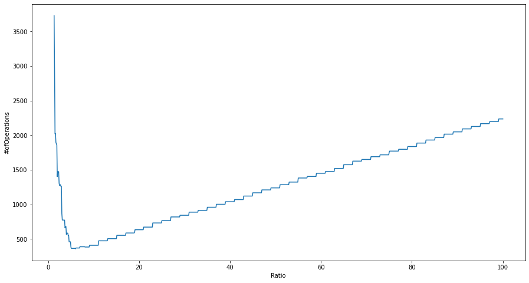
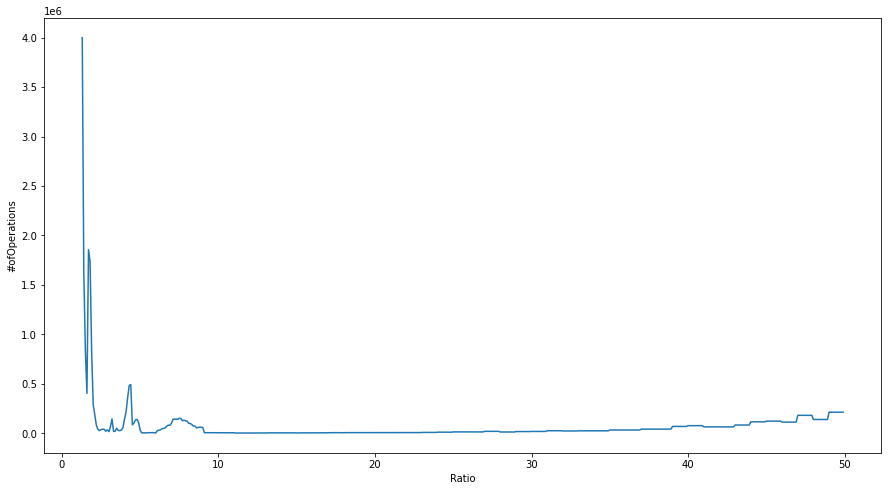
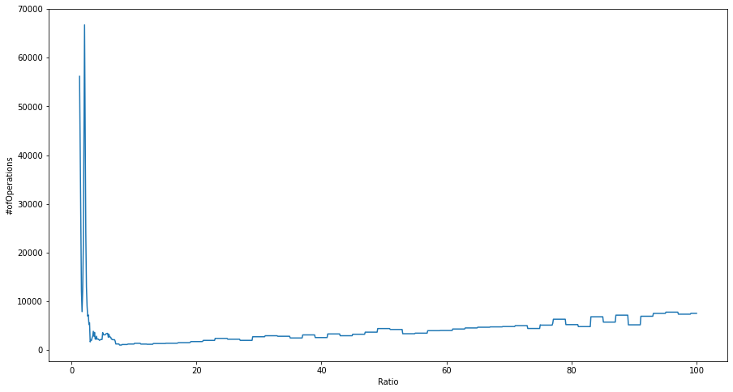

# Puzzle
## Графики
Зависимость количества операций от отношения 
```math
ratio = a / b
```
```math
priority = a*manhattan_distance + b*moves
```
- 4*4
  | 1  |  2 |  3 |  4 |
  |---|---|---|---|
  | 7  | 5  | 6 | 8  |
  | 9  | 10  | 11  |  12 |
  | 14  | 15   | 13  | 0  |
  
-4*4
  | 7 |  6 |  13 |  10 |
  |---|---|---|---|
  | 8  | 9  | 0 | 11  |
  | 15  | 2  | 12  |  5 |
  | 3  | 1   | 14  | 4 |
  
-3*3
  | 1 | 8 |  12 |
  |---|---|---|
  | 0  | 4  | 3 |
  | 7  | 6  | 5 |
  
-4*4
  | 2 |  10 |  13 |  3 |
  |---|---|---|---|
  | 1  | 12  | 8 | 4  |
  | 5  | 0  | 9  |  6 |
  | 15  | 14  | 11  | 7 |
  